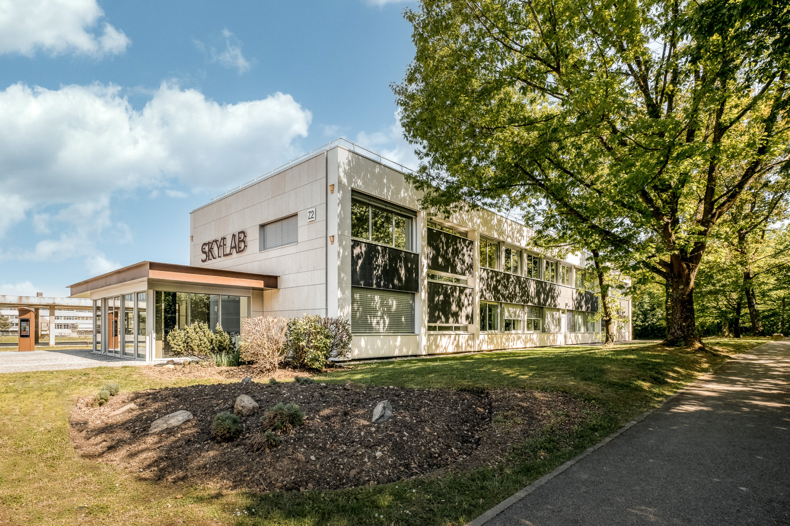

# Welcome!

## 2025 Summer School on "Power Grid Dynamics, Stability and Control"

**Dates:** Monday June 23rd (10:00 am) to Friday 27th, 2025 (5:30 pm).

The Summer School consists of a five-days PhD-level course that provides an to introduction to the dynamics, stability and control of power grids, suitable for PhD students at their beginning of their doctoral program in Electrical Engineering or related areas.

The Summer School will provide an introduction to fundamental concepts for the analysis of power system performance in steady-state (i.e., power flow) and power grid dynamics (mainly electromechanical transients), as well as analysis methods, with computer-based exercises, as further described [here](./02_Course-Content.md).

The course will take place at the [Ecole Centrale de Lyon (ECL)](https://www.ec-lyon.fr/en), located in [Ecully](https://fr.wikipedia.org/wiki/%C3%89cully), which is part of the [Greater Lyon](https://en.wikipedia.org/wiki/Metropolis_of_Lyon) metropolitan area, and near [Lyon](https://en.visiterlyon.com/). 

The summer school will be held in hybrid mode. Participants can thus attend the school in person (on the campus of Ecole Centrale de Lyon) or virtually. 

For this purpose, we will make use of the brand-new lecture hall of Ecole Centrale de Lyon that is completely dedicated to hybrid teaching. This lecture hall is located in the SKYLAB of Ecole Centrale (see [here](https://www.youtube.com/watch?v=g4hIaQZmtjU) and [here](https://www.ec-lyon.fr/en/campuses/campus-lyon-ecully/life-and-innovation-spaces-centrale-lyon) for more details and a video about this facility). 

**Note that the number of participants attending "in person" is limited to 20.**

More information about the contents of the course can be found [here](./02_Course-Content.md).

