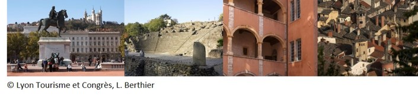

# Program

The course is schedule and topics are listed in the table below.

<iframe src="https://docs.google.com/spreadsheets/d/e/2PACX-1vRHIAhM4M9oUWvcI23r9_h0Iura06n37jjGSBtAuwF-KRLdY6WEB2B8L0QPUW3HL0xNqNX7KXRD72lc/pubhtml?gid=0&amp;single=true&amp;widget=true&amp;headers=false" width="955" height="380"  ></iframe>

**Note:** Breaks from 12:00 - 14:00 hrs. are for lunch. As the course is free-of-charge, lunch **will not be provided**. Participants should also bring their own refreshments for the other breaks.

The course will take place in the venue described [here](./04_Venue-Travel-etc.md).

