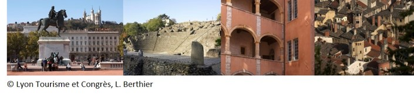

# Venue, Travel and Other Information
## Venue
The Summer School will be held on the campus of the [Ecole Centrale de Lyon (ECL)](https://www.ec-lyon.fr/en).

**The campus is located at the following address:** *36 avenue Guy de Collongue, 69130 Ecully, France*

<iframe src="https://www.google.com/maps/embed?pb=!1m18!1m12!1m3!1d1357.6385872362978!2d4.766051986238957!3d45.7824882957582!2m3!1f0!2f0!3f0!3m2!1i1024!2i768!4f13.1!3m3!1m2!1s0x47f4ec9529579211%3A0xf9dafe9c0d9620e3!2s%C3%89cole%20Centrale%20de%20Lyon!5e1!3m2!1sen!2sus!4v1738214223759!5m2!1sen!2sus" width="400" height="300" style="border:0;" allowfullscreen="" loading="lazy" referrerpolicy="no-referrer-when-downgrade"></iframe>

You can find the location above from Google Maps [here](https://maps.app.goo.gl/xTgBsjDLu3CseQv6A).

The lecture hall is located in the SKYLAB (building Z2). A map of the campus is is available [here](./assets/map.pdf).

## Travel and Transportation
Lyon benefits from:
- an international airport (Lyon Saint Exupéry) with direct flights to major cities in France and Europe 
- two major railway stations (Lyon Part-Dieu and Lyon Perrache) with direct TGV connections to the majors cities in France. 

A [tramway](https://www.rhonexpress.fr/en) connects the airport to the railway station of Lyon Part-Dieu in 30 minutes.

From the railway stations Lyon Part-Dieu and Lyon Perrache, the campus of the "Ecole Centrale" can be reached by public transportation. **The corresponding bus stop is "Campus Lyon Ouest".**

From Lyon Part-Dieu, [bus line C6](https://www.tcl.fr/lignes/ligne-majeure-c6) will bring you to the stop "Campus Lyon Ouest" (end stop of bus line C6)

From Lyon Perrache, [bus line 55](https://www.tcl.fr/lignes/bus-55) will bring you to the stop "Campus Lyon Ouest" (end stop of bus line 55).

More information on public transportation in Lyon can be found at this [link](http://www.tcl.fr/).

### Lodging
For those traveling for the Summer School, here are a couple of options:
- The [Residence Paul Comparat](https://www.lyoncampus.com/vivre/se-loger/liste-des-residences-etudiantes/detail/residence-paul-comparat-centrale-lyon) is a student residence on the campus of ECL.
- The [Campanile Lyon Nord - Ecully](https://lyon-nord-ecully.campanile.com/fr-fr/?utm_content=partoo&utm_medium=seo-bgp&utm_source=google) hotel is located just a few minutes from the venue.

A list of hotels and B&B can be found [here](https://www.ecully.fr/ma-ville/tourisme/les-hebergements-de-tourisme-487.html).

Please note that you must arrange for your lodging personally/individually.

To register for the course, please follow the link [here](./05_Registration.md).

