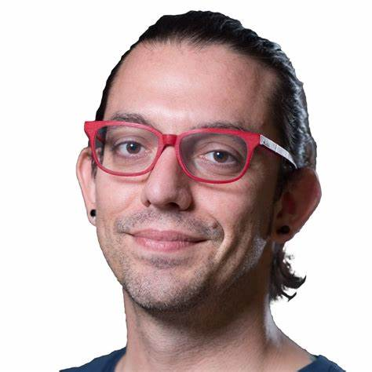

# Organization

## Organizing Team
**Local Organization**: [Dr. Xavier Bombois (CNRS, Laboratoire Ampère)](https://cv.hal.science/xavier-bombois-cnrs)

**Course Instructor / Organizer**: [Prof. Luigi Vanfretti (RPI, ECSE)](https://faculty.rpi.edu/luigi-vanfretti)

To contact the course organizers follow the link [here](./07_Contact-and-Info.md).

### Acknowledgement
The organizers wish to thank the [Ecole Centrale de Lyon](https://www.ec-lyon.fr/en) for [selecting Prof. Vanfretti as Visiting Faculty](https://ecse.rpi.edu/news/ecse-prof-luigi-vanfretti-selected-invited-professor-ecl-lyon-france), which made it possible to organize this course.

